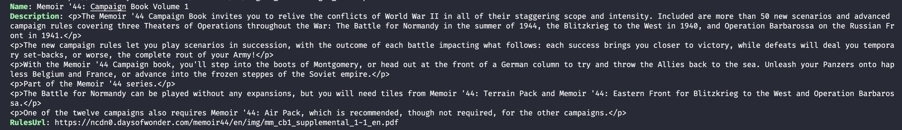

# GeeksHacking Go Workshop

This is a [Go workshop organised by GeeksHacking](https://www.eventbrite.sg/e/beginning-with-go-tickets-403920636497?utm_source=eventbrite&utm_medium=email&utm_campaign=event_reminder&utm_term=eventname), and conducted by [Chuk Munn Lee](https://github.com/chukmunnlee/) on 3 September 2022. This is also the first workshop by [GeeksHacking](https://www.geekshacking.com/) in 2-3 years since COVID19! 

Notes are taken by [@lyqht](https://github.com/lyqht).

---

**Table of contents**
  - [Slides](#slides)
  - [Setup Go instructions](#setup-go-instructions)
  - [Creating the Boardgame Atlas CLI app](#creating-the-boardgame-atlas-cli-app)
    - [Learn to run and build a simple Go module](#learn-to-run-and-build-a-simple-go-module)
    - [Add an API service call](#add-an-api-service-call)
    - [Setting Terminal color](#setting-terminal-color)
  - [Resources on Go Concepts](#resources-on-go-concepts)
    - [Assigning & getting values](#assigning--getting-values)
    - [Custom Types](#custom-types)
    - [Class Like](#class-like)
    - [Goroutines](#goroutines)
    - [Creating Go Modules](#creating-go-modules)
  - [Random nuggets](#random-nuggets)

---

## Slides

Workshop slides can be found [here](https://bit.ly/golang_for_programmers). A PDF copy is also available in this repository.

## Setup Go instructions

1. Follow the instructions in [this doc](https://docs.google.com/document/d/1gOeMDiZKQNcIOHvlWA3Zm5qybQtVMmoqgJnfK9IU3Zw/edit) to setup Go & BoardGameAtlas API Client
2. If you are able to download repositories but cannot see them in your `src` folder, you can try running
   ```bash
    go env -w GO111MODULE=off
   ```

   And if you are unable to run `go mod init main` later on, you have to switch this back to auto.
   ```bash
    go env -w GO111MODULE=auto
   ```

   You can refer to [this documnentation to understand more about what is GO111MODULE](https://dev.to/maelvls/why-is-go111module-everywhere-and-everything-about-go-modules-24k?i=i).


## Creating the Boardgame Atlas CLI app

### Learn to run and build a simple Go module

1. Create a empty folder anywhere you like e.g. `bga`, then `cd bga`.
1. Run `mod init main`. You will see a new `go.mod` file generated in your project. 
1. Create a `main.go` file. In this file, enter this code.
    ```go
    package main

    import (
      "flag"
      "fmt"
    )

    func main() {
      query := flag.String("query", "", "Board game name to search")
      clientId := flag.String("clientId", "", "Board Atlas Client ID")
      skip := flag.Uint("skip", 0, "Skips the number of results provided")
      limit := flag.Uint("limit", 0, "Limits the number of results provided")

      flag.Parse()
      fmt.Printf("query=%s, clientId=%s, limit=%d, skip=%d\n", *query, *clientId, *limit, *skip)
    }
    ```
1. You can run this file directly with flags as defined in your program.
   ```bash
    go run . --limit=5 --skip=1 --query=catan --clientId=abc123
   ```
1. To build the program as an executable, run
    ```bash
    go build .
    ```

    You should see a new `main` file generated without any file extension.
1. Then you can start the program by running
    ```bash
    ./main
    ```

### Add an API service call

1. Next, create a new folder `api`, and create a new file `search.go` in it with the following code. We are using the object pattern to declare a **class like**, and the constructor method for it. 
    ```go
    package api

    type BoardgameAtlas struct {
      clientId string
    }

    // Class-like Constructor method in Go
    func New(clientId string) BoardgameAtlas {
      return BoardgameAtlas{clientId}
    }
    ```
1. Then at the `main.go` file, we can add code to instantiate a BGA client in the `main()` function.
    ```go
    import (
      //...
      "main/api"
    )
    func main() {  
      //...
      fmt.Printf("query=%s, clientId=%s, limit=%d, skip=%d\n", *query, *clientId, *limit, *skip)

      bga := api.New(*clientId)
    }
    ```
1. We will add a search function to the search module. In doing so, we will add additional library imports, a constant API endpoint URL and the function that uses them. 
    ```go
    package api

    import (
      "context"
      "fmt"
      "net/http"
    )

    const SEARCH_URL = "https://api.boardgameatlas.com/api/search"

    func (b BoardgameAtlas) Search(ctx context.Context, query string, limit uint, skip uint) error {
      req, err := http.NewRequestWithContext(ctx, http.MethodGet, SEARCH_URL, nil)
      if nil != err {
        return fmt.Errorf("Cannot create HTTP Client: $v", err)
      }

      return nil // we are not returning the response yet
    }
    ```
2. In Go, it is not straight forward to create a HTTP request to be made — we need to create a Query instance and add query parameters to it, before encoding it and calling it with a http default client.
    ```go
    func (b BoardgameAtlas) Search(ctx context.Context, query string, limit uint, skip uint) error {
      req, err := http.NewRequestWithContext(ctx, http.MethodGet, SEARCH_URL, nil)
      if nil != err {
        return fmt.Errorf("Cannot create HTTP Client: $v", err)
      }

      qs := req.URL.Query()
      qs.Add("name", query)
      qs.Add("limit", fmt.Sprintf("%d", limit))
      qs.Add("skip", strconv.Itoa(int(skip))) // you can use fmt.sprintf as well, either casting method works.
      qs.Add("client_id", b.clientId)

      // encode query params and add it back to the request
      req.URL.RawQuery = qs.Encode()

      fmt.Printf("URL - %s\n", req.URL.String())

      resp, err := http.DefaultClient.Do(req)
      if nil != err {
        return fmt.Errorf("cannot create HTTP Client: %v", err)
      }

      if resp.StatusCode >= 400 {
        return fmt.Errorf("error HTTP status: %s", resp.Status)
      }

      return nil // we are not returning the response yet
    }
    ```
3. Then we can call the search function at `main.go`'s main function. You should be able to see the generated URL that the http request will be made to in your console.
    ```go
  	bga.Search(context.Background(), *query, *limit, *skip)
    ```
5. Now for us to see the API response, we need to deserialize the response JSON before returning it from the search function. We need to create new class likes, for it to map from the response json fields.
   ```go
    type Game struct {
      Id            string `json:"id"`
      Name          string `json:"name"`
      Price         string `json:"price"`
      YearPublished uint   `json:"year_published"`
      Description   string `json:"description"`
      ImageUrl      string `json:"image_url"`
      RulesUrl      string `json:"rules_url"`
    }

    type SearchResult struct {
      Games []Game `json:"games"`
      Count uint   `json:"count"`
    }

    func (b BoardgameAtlas) Search(ctx context.Context, query string, limit uint, skip uint) (*SearchResult, error) {
      // ...
      if resp.StatusCode >= 400 {
        return nil, fmt.Errorf("error HTTP status: %s", resp.Status)
      }

      var result SearchResult
      if err := json.NewDecoder(resp.Body).Decode(&result); nil != err {
        return nil, fmt.Errorf("cannot deserialize JSON payload: %v", err)
      }

      return &result, nil
    }
   ```
1. Then at `main.go` we can grab the result and display some of the fields in our console.
   ```go
    result, err := bga.Search(ctx, *query, *limit, *skip)
    if nil != err {
      log.Fatalf("Cannot search foxwr boardgame: %v", err)
    }

    for _, game := range result.Games {
      fmt.Printf("Name: %s\n", game.Name)
      fmt.Printf("Description: %s\n", game.Description)
      fmt.Printf("RulesUrl: %s\n", game.RulesUrl)
    }
   ```
1. Run `go run --query=memoir --clientId=abc123 --limit=10` to see some results! 
    
    > **Make sure to use a valid clientId**.

### Setting Terminal color

We can import [the color library](https://github.com/fatih/color) by following the instructions of the repo.

Then at `main.go`, we just need to import the color library and change the printing of the game details to something like the code below which turns the game field labels to green. 

```go
import (
  //...
  "github.com/fatih/color"
)

func main() {
  //...
  boldGreen := color.New(color.Bold).Add(color.FgHiGreen).SprintFunc()

  for _, game := range result.Games {
    fmt.Printf("%s: %s\n", boldGreen("Name"), game.Name)
    fmt.Printf("%s: %s\n", boldGreen("Description"), game.Description)
    fmt.Printf("%s: %s\n", boldGreen("RulesUrl"), game.RulesUrl)
  }
}
```



## Resources on Go Concepts

Here are some concepts mentioned in the presentation, supplemented with resources. Go's design & syntax is pretty similar to a mixture of C + Typescript.

### Assigning & getting values

```go
name:= "fred" // assign content to variable
&name // a pointer/ memory address of variable
*&name // content of memory address
```

### Custom Types

[Golang Custom Type Declarations: The Complete Guide](https://appdividend.com/2019/03/22/go-custom-type-declarations-tutorial-with-example/)

### Class Like

[Structs instead of classes](https://golangbot.com/structs-instead-of-classes/)

### Goroutines

[Goroutine definition and examples](https://zetcode.com/golang/goroutine/)

### Creating Go Modules

[How go mod init works](https://go.dev/doc/tutorial/create-module)

## Random nuggets

- Uppercase variables are public, lowercase is private.
- Declaring function inputs and outputs is similar to Typescript, but without `:`.
- In JavaScript, you have to install formatters like prettier or eslint to automatically remove unused imports or variables. But in Go, these will be removed by default if you have the Go extension installed in your Visual Studio Code.
- `nil in Go === null in JS`
- Go doesn't throw exceptions, need check manually if there is error and the error code directly.
- GoLang cannot understand JSON directly
- Why we return a pointer instead of the object directly
  -  In JS/Typescript, Java, objects and arrays are references.
  -  In Go, if we set the return type to be `SearchResult` instead of `*SearchResult`, then we cannot return nil if there is an error. We would need to create an empty `SearchResult` object. This is wasted memory.
